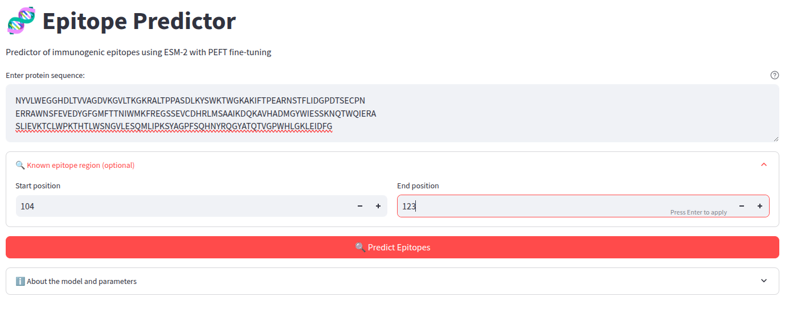

# Epitope Predictor Mirror

<p align="center">
  <a href="https://huggingface.co/spaces/sergiolitwiniuk/epitope-predictor">
    
  </a>
  <a href="https://huggingface.co/sergiolitwiniuk/adapter-esm2-150M">
    
  </a>
</p>

---

## 🧐 About this Project

This repository serves as a **"mirror"** (replica) of the **Epitope Predictor** project, a biological language model fine-tuned for epitope prediction. The model uses an `Esm2-150M` adapter to identify amino acid sequences likely to form an epitope—the part of a molecule recognized by the immune system.

The goal of this repository is to provide a backup and an alternative access point to the model and its associated scripts, ensuring the project is accessible and easy to replicate.

## 🚀 Resources and Links

All the main components of the project are available on the Hugging Face platform:

- **Hugging Face Space (Interactive Demo)**: You can interact with the model directly through the web interface at the following link:
  - [**sergiolitwiniuk/epitope-predictor**](https://huggingface.co/spaces/sergiolitwiniuk/epitope-predictor)

- **Adapter Model**: The fine-tuned model (`adapter-esm2-150M`) is hosted on the Hugging Face Hub, where it can be downloaded and used in your own projects:
  - [**sergiolitwiniuk/adapter-esm2-150M**](https://huggingface.co/sergiolitwiniuk/adapter-esm2-150M)

🧪 Sample Results

Here are some screenshots of the deployed Epitope Predictor tool to demonstrate its functionality.

Main Interface: This image shows the user interface of the Hugging Face Space where you can input a protein sequence to be analyzed.



Prediction Results: After processing, the tool provides a graphical representation of the predicted epitopes. This visual output makes it easy to identify the regions of interest within the sequence.


CSV Export: The results can also be exported in a structured format, like a CSV file, for further analysis. This image shows a snippet of the data that can be downloaded.


## 💻 Local Usage (not available yet, although you can use the adapter)

To use the model locally, clone this repository and ensure you have the necessary dependencies.

### 1. Clone the Repository

```bash
git clone [https://github.com/your_username/epitope-predictor-mirror.git](https://github.com/your_username/epitope-predictor-mirror.git)
cd epitope-predictor-mirror
````


### 2\. Load the Model

You can load the model and adapter in Python using the Hugging Face `transformers` library.

```python
from transformers import AutoModelForMaskedLM, AutoTokenizer
from peft import PeftModel

# Load the base model
model_name = "facebook/esm2_t6_8M_UR50D"
model = AutoModelForMaskedLM.from_pretrained(model_name)
tokenizer = AutoTokenizer.from_pretrained(model_name)

# Load the adapter from the repository
adapter_model = PeftModel.from_pretrained(model, "sergiolitwiniuk/adapter-esm2-150M")

# Now you can use the 'adapter_model' for inference
```

## 📜 License

This project is distributed under the [**MIT License**](https://opensource.org/licenses/MIT).

-----

```
```
